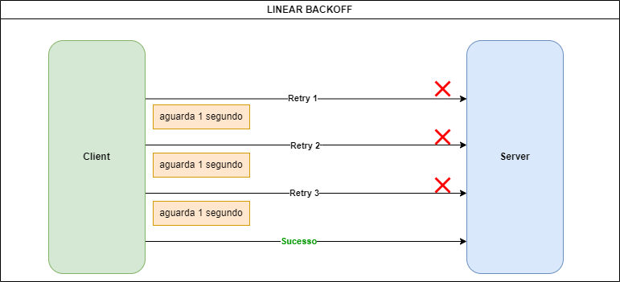

  
  <h1>POC - Estratégias de Retry Pattern com Backoff Exponencial e Jitter: Prevenindo Sobrecarga em Sistemas com Resilience4j e Spring Boot 3</h1>

<!-- Badges -->

    <a href="#"><strong>ARTIGO DO PROJETO</strong></a>

<!-- About the Project -->
## :star2: Sobre o projeto:

    Hoje vou falar sobre um padrão de resiliência conhecido como <b>"Retry Pattern"</b>, que tem como objetivo permitir que um sistema faça novas tentativas em caso de falha. Com a crescente prevalência de sistemas distribuídos nos dias de hoje, a aplicação do Retry Pattern é crucial para lidar com indisponibilidades e garantir a continuidade do serviço.

Agora vamos explorar quatro tipos de estratégias de Retry utilizadas para lidar com falhas em sistemas distribuídos:

A primeira estratégia é o <b>Linear Backoff</b>, onde o intervalo entre as tentativas de retentativa é fixo. Embora seja simples de implementar, essa abordagem pode não ser ideal em situações de alta carga ou ambientes com muita concorrência, pois pode levar a contenção de recursos ou a "tempestades de retentativas", onde múltiplos clientes fazem novas tentativas ao mesmo tempo, agravando o problema inicial.

**Diagrama: Linear Backoff entre cliente (solicita) e servidor (responde). Retransmissão com espera de 1 segundo a cada nova chamada ao servidor.**

A segunda estratégia é o <b>Linear Jitter Backoff</b>, que modifica a estratégia de linear backoff ao introduzir uma variação aleatória nos intervalos de retentativa. Essa abordagem adiciona uma camada de imprevisibilidade, o que ajuda a evitar que todos os clientes sincronizem suas tentativas de retentativa. No entanto, ainda pode haver problemas potenciais, uma vez que o intervalo base aumenta apenas linearmente, não mitigando completamente os riscos de sincronização.

**Diagrama: Exponential Backoff entre cliente (solicita) e servidor (responde). Retransmissão com espera de exponencial a cada nova chamada ao servidor.**

A terceira estratégia é o <b>Exponential Backoff</b>, que aumenta o intervalo entre as tentativas de retentativa de forma exponencial. Essa abordagem é eficaz para evitar a sobrecarga de sistemas, pois as tentativas de retentativa são espaçadas de maneira cada vez mais ampla, reduzindo a probabilidade de "tempestades de retentativas". No entanto, em situações onde uma rápida retentativa pode resolver o problema, esse método pode causar atrasos desnecessários na resolução do problema.

**Diagrama: Exponential Backoff entre cliente (solicita) e servidor (responde). Retransmissão com espera de exponencial a cada nova chamada ao servidor.**

Finalmente, temos o <b>Exponential Jitter Backoff</b>, que combina o backoff exponencial com uma variação aleatória nos intervalos de retentativa. Essa estratégia é particularmente eficaz para evitar problemas de sincronização, pois a aleatoriedade impede que múltiplos clientes façam novas tentativas simultaneamente. Entretanto, a introdução de aleatoriedade também pode resultar em atrasos maiores do que o necessário em alguns casos.

**Diagrama: Exponential Jitter Backoff entre cliente (solicita) e servidor (responde). Retransmissão com espera de exponencial com um variação aleatória a cada nova chamada ao servidor.**

Cada uma dessas estratégias tem seus próprios benefícios e trade-offs, sendo importante escolher a mais adequada com base nas características e necessidades específicas do sistema em questão.

Incorporar o conceito de retry na estrutura do sistema é crucial para assegurar sua robustez e confiabilidade, especialmente em ambientes onde diversos serviços dependem uns dos outros. Implementar esse padrão de maneira adequada pode ser determinante para manter o sistema operacional mesmo diante de desafios, evitando falhas frequentes. Adicionalmente, é essencial dominar e aplicar estratégias como o aumento exponencial do intervalo entre tentativas e o uso de jitter, para garantir que as tentativas de retry sejam eficazes e eficientes.

